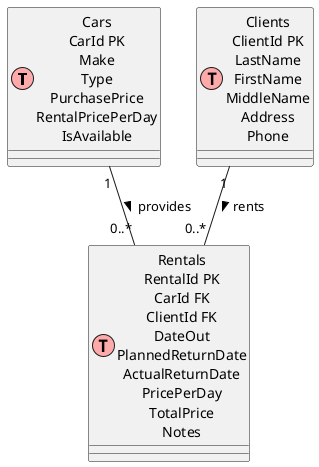
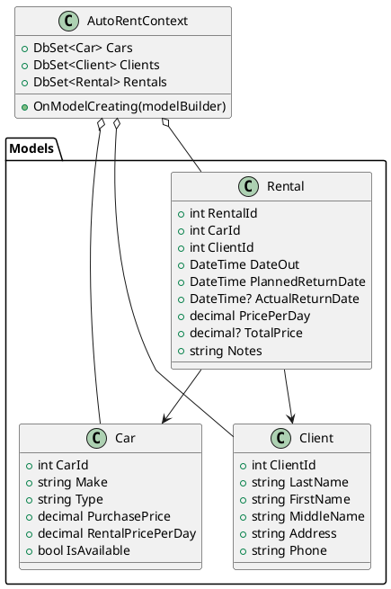
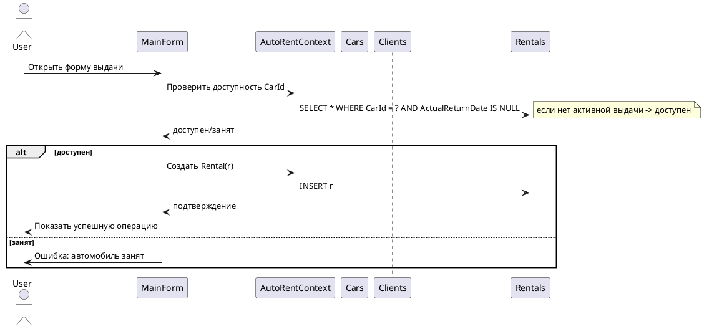

# Техническое задание (ТЗ) — Вариант 19: «Прокат автомобилей»

*(подробное ТЗ + PlantUML-диаграммы + требования по всем 5 лабораторным работам, согласно методичке)*

Я внимательно прочитал методичку и вынес оттуда все требования, которые относятся к выбранному варианту (№19 — Прокат автомобилей) и к выполнению всех пяти лабораторных работ. Основные положения методички использованы при формировании ТЗ.     

---

# 1. Краткое описание разрабатываемого продукта

**Название:** AutoRent — приложение «Пункт проката автомобилей» (Windows Forms)
**Цель:** автоматизировать учёт автопарка, клиентов и операций выдачи/возврата автомобилей, формировать отчёты (Word, Excel, HTML), поддерживать импорт/экспорт данных, и продемонстрировать работу с EF Core (Code-First или Database-First), миграциями, LINQ-фильтрами и объектными моделями Office. (Соответствует содержанию методички и требованиям лабораторных.) 

**Кому предназначено:** преподавательская проверка лабораторных + демонстрация функционала (студент/лабораторный образец).
**Платформа:** .NET (рекомендуется .NET 8 или .NET 7), Windows Forms (WinForms).

---

# 2. Основные функциональные требования (по лабораторным)

(Связь с нумерацией лабораторных из методички)

**ЛР1 (EF Core, провайдеры):**

* Проект должен использовать EF Core и выбранный управляемый провайдер (например, PostgreSQL через Npgsql или MySQL Pomelo); поддерживается Code-First (рекомендуется) с миграциями EF. В базе — минимум **3 связанных таблицы** (Автомобили, Клиенты, Выдачи). В каждой таблице — не менее 3 полей. Поддержать каскадное удаление где уместно.

**ЛР2 (Доступ и интерфейс, CRUD, LINQ):**

* Реализовать интерфейс Windows Forms: DataGridView для каждой таблицы (главная/подчинённая), CRUD операции (добавление/редактирование/удаление), сохранение через `dbContext.SaveChanges()`.
* Реализовать фильтрацию и выборки через LINQ; минимум **одна фильтрация должна использовать связь между таблицами**; обеспечить фильтрацию по как минимум двум полям.

**ЛР3 (Word):**

* Генерация документов Word по шаблону (пример: договор аренды, акт выдачи) — минимум 2 шаблона; хотя бы один документ содержит таблицу; поддержать замену плейсхолдеров и вставку данных из БД. Можно использовать Interop или OpenXML. 

**ЛР4 (Excel):**

* Экспорт данных (отчёты) в Excel (минимум два отчёта; хотя бы один — агрегированный по всем таблицам); импорт из `.xlsx` в БД с проверкой дубликатов; подготовить статистику импорта/ошибок; использовать Interop или EPPlus/OpenXML. 

**ЛР5 (HTML):**

* Экспорт отчётов в HTML (минимум два отчёта; один — работа со связями/группировкой), реализовать сохранение через SaveFileDialog и корректную генерацию HTML. 

---

# 3. Функциональные требования — подробный список (User stories / use cases)

1. **UC1 — Управление автомобилями**

   * Добавить/редактировать/удалить автомобиль.
   * Просмотр списка автомобилей (фильтрация по типу, марки, цене).
2. **UC2 — Управление клиентами**

   * CRUD клиента (ФИО, адрес, телефон, e-mail).
3. **UC3 — Выдача автомобиля**

   * Создать запись выдачи: выбрать клиента и автомобиль, дата выдачи, планируемая дата возврата, цена аренды.
   * Проверка, что автомобиль свободен на выбранные даты.
4. **UC4 — Возврат автомобиля**

   * Закрыть запись выдачи, заполнить фактическую дату возврата, рассчитанная стоимость (с учётом дней и возможных штрафов).
5. **UC5 — Отчёты**

   * Сформировать Word/Excel/HTML отчёты: список текущих аренды, финансовый отчёт за период, список автомобилей с загрузкой.
6. **UC6 — Импорт/Экспорт**

   * Импорт клиентов/автомобилей/выдач из Excel с проверкой и отчётом.
   * Экспорт текущих данных в Excel/HTML, печать Word-документа.
7. **UC7 — Фильтрация и поиск**

   * Фильтровать выдачи по датам, клиенту, автомобилю; хотя бы один фильтр — по полю другой таблицы (например, фильтр выдач по фамилии клиента). 

---

# 4. Нефункциональные требования

* **Язык/платформа:** C#, .NET (7/8), WinForms.
* **БД:** PostgreSQL (рекомендуется) / MySQL / SQL Server — выбор студента, требование: поддержка EF Core provider. (в методичке даётся свобода выбора). 
* **Безопасность:** вход в приложение не обязателен (лабораторный проект), однако при сохранении/обновлении транзакции оборачивать в try/catch и логировать ошибки.
* **Производительность:** работа с локальной БД — несущественно.
* **Тестируемость:** миграции должны применяться корректно (`Add-Migration`, `Update-Database`). 
* **Отчёты/совместимость:** использовать Interop или OpenXML/EPPlus для Office; корректно освобождать COM-объекты при использовании Interop.

---

# 5. Проект данных — схема БД (предварительная)

**Три таблицы (минимум):**

1. `Cars` (Автомобили)

   * `CarId` INT PK (автоинкремент)
   * `Make` VARCHAR(100) — марка/модель
   * `Type` VARCHAR(50) — тип (седан, внедорожник и т.д.)
   * `PurchasePrice` DECIMAL(12,2) — стоимость машины (опционально)
   * `RentalPricePerDay` DECIMAL(10,2) — стоимость аренды в день
   * `IsAvailable` BOOLEAN — доступность (опционально, рассчитывать по выдачам)

2. `Clients` (Клиенты)

   * `ClientId` INT PK
   * `LastName` VARCHAR(100)
   * `FirstName` VARCHAR(100)
   * `MiddleName` VARCHAR(100) NULL
   * `Address` VARCHAR(250)
   * `Phone` VARCHAR(50)

3. `Rentals` (Выданные автомобили)

   * `RentalId` INT PK
   * `CarId` INT FK → Cars(CarId) **(ON DELETE CASCADE)**
   * `ClientId` INT FK → Clients(ClientId) **(ON DELETE CASCADE)**
   * `DateOut` DATE NOT NULL
   * `PlannedReturnDate` DATE NOT NULL
   * `ActualReturnDate` DATE NULL
   * `PricePerDay` DECIMAL(10,2) (копия на момент аренды)
   * `TotalPrice` DECIMAL(12,2) NULL
   * `Notes` TEXT NULL

> Примечание: структура соответствует предметной области варианта 19 в приложении методички. 

---

# 6. ER-диаграмма (PlantUML)

Вставляю PlantUML-код, который вы можете скопировать в любой PlantUML-редактор (или на сайт plantuml.com) для отрисовки ER-диаграммы:



---

# 7. Классовая диаграмма (модели + DbContext) — PlantUML



---

# 8. Последовательность операций (PlantUML) — пример «Выдача автомобиля»



---

# 9. Команды и рекомендации по EF Core (миграции)

* Добавить пакеты (пример для PostgreSQL):
  `dotnet add package Microsoft.EntityFrameworkCore`
  `dotnet add package Microsoft.EntityFrameworkCore.Tools`
  `dotnet add package Npgsql.EntityFrameworkCore.PostgreSQL`
  (Для MySQL: `Pomelo.EntityFrameworkCore.MySql`.) 
* Примерный рабочий цикл:

  1. `Add-Migration InitCreate` (Package Manager Console) или `dotnet ef migrations add InitCreate`
  2. `Update-Database` или `dotnet ef database update`
* В `OnModelCreating` — конфигурировать связи и правило `OnDelete(DeleteBehavior.Cascade)` там, где нужно. 

---

# 10. UI — структура форм (коротко)

* **MainForm** — вкладки: Автомобили, Клиенты, Выдачи, Отчёты, Импорт/Экспорт
* **CarsForm** — DataGridView (список), кнопки Add/Edit/Delete, фильтры (по типу, марке)
* **ClientsForm** — аналогично
* **RentalsForm** — два DataGridView: список выдач; справа форма создания/закрытия аренды; фильтры по дате/клиенту/авто (один фильтр — по фамилии клиента) 
* **ReportsForm** — создание Word/Excel/HTML отчётов с выбором периода и параметров

---

# 11. Отчёты и импорт/экспорт — спецификация

* **Word**: шаблон договора (Placeholders: {ClientName}, {Car}, {DateOut}, {PlannedReturnDate}, {Price}) и акт приёма/передачи (таблица с деталями). Реализация: Interop (`Microsoft.Office.Interop.Word`) или OpenXML. 
* **Excel**: финансовый отчёт (свод по дням/месяцам), лист «Все данные» — таблица со связями (подстановка фамилии клиента по ClientId). При импорте: проверять пустые строки, дубликаты; формировать статистику «добавлено / пропущено / дубли». 
* **HTML**: форматированный список текущих аренд, группировка по клиенту или по автомобилю; сохранить через `SaveFileDialog`. 

---

# 12. Требования к отчёту по лабораторной (что должно быть в отчёте)

(Согласно методичке — для каждой ЛР обязательно)

* Наименование и цель работы.
* Задание: вариант 19 — предметная область «Прокат автомобилей». 
* Структура разработанной БД, модели сущностей, обработчики событий.
* Листинги ключевых участков кода (DbContext, модели, CRUD, экспорт/импорт, генерация Word/XLS/HTML).
* Скриншоты работающих форм/отчётов.
* Описание, какие пакеты и версии использованы, как запускать миграции. 

---

# 13. План работ / чек-лист (пошагово)

1. Создать проект WinForms (.NET).
2. Подключить EF Core + выбранный провайдер. (`dotnet add package ...`). 
3. Создать модели `Car`, `Client`, `Rental`.
4. Создать `AutoRentContext` + `OnModelCreating` (Fluent API) — связки и `OnDelete(DeleteBehavior.Cascade)`. 
5. Сделать миграцию `Add-Migration Init` и `Update-Database`.
6. Реализовать формы и привязку DataGridView (загрузка через `dbContext.Phones.Load()` аналог — `dbContext.Rentals.Load()`/Local). 
7. Реализовать CRUD и LINQ-фильтры (двухполевая фильтрация, одна использует связи). 
8. Реализовать экспорт/импорт Excel + отчёт импорта. 
9. Реализовать генерацию Word-документов по шаблонам. 
10. Реализовать HTML-отчёты. 
11. Подготовить отчёт (листинги, скриншоты, инструкции по запуску миграций).

---

# 14. Примеры: EF Core модель (C#), упрощённо

```csharp
public class Car {
    public int CarId { get; set; }
    public string Make { get; set; }
    public string Type { get; set; }
    public decimal RentalPricePerDay { get; set; }
    public bool IsAvailable { get; set; }
}

public class Client {
    public int ClientId { get; set; }
    public string LastName { get; set; }
    public string FirstName { get; set; }
    public string Phone { get; set; }
}

public class Rental {
    public int RentalId { get; set; }
    public int CarId { get; set; }
    public Car Car { get; set; }
    public int ClientId { get; set; }
    public Client Client { get; set; }
    public DateTime DateOut { get; set; }
    public DateTime PlannedReturnDate { get; set; }
    public DateTime? ActualReturnDate { get; set; }
    public decimal PricePerDay { get; set; }
    public decimal? TotalPrice { get; set; }
}
```

`OnModelCreating` пример (Fluent API):

```csharp
protected override void OnModelCreating(ModelBuilder modelBuilder)
{
    modelBuilder.Entity<Rental>()
        .HasKey(r => r.RentalId);

    modelBuilder.Entity<Rental>()
        .HasOne(r => r.Car)
        .WithMany()
        .HasForeignKey(r => r.CarId)
        .OnDelete(DeleteBehavior.Cascade);

    modelBuilder.Entity<Rental>()
        .HasOne(r => r.Client)
        .WithMany()
        .HasForeignKey(r => r.ClientId)
        .OnDelete(DeleteBehavior.Cascade);
}
```

(Рекомендация: добавить `ToString()` для сущностей, если используете в ComboBox). 

---

# 15. Что я выполнил в этом документе и что дальше могу сделать

В этом документе: полностью разработано детальное ТЗ по варианту 19, включены PlantUML-диаграммы (ER, классная диаграмма, последовательность выдачи), данные схемы БД, чек-лист, разбиение по лабораторным требованиям и примеры кода/команд миграций — всё в соответствии с методичкой. Соответствующие положения методички приведены/цитированы выше.

Если хотите, дальше могу (выберите одно или несколько):

1. Сгенерировать файлы PlantUML в виде изображений/PNG (я могу дать PlantUML-код, вы сможете отрендерить локально или в сети).
2. Подготовить скелет проекта — структуру каталогов и шаблонные файлы C# (Models, Data, Forms) с минимальной реализацией и командами `dotnet` + `ef`.
3. Сделать подробный шаблон отчёта (Word/markdown) с заполненными разделами и местами для вставки скриншотов/листингов.
4. Написать реализацию одной ключевой функции (например: форма выдачи с проверкой доступности + миграция).

И так теперь когда у тебя есть ТЗ сделай план по разработке этого

Но учитывай что это всего лишь Лабы и главное что бы ПО было удобным и читаемым и легко редактиремым именно для нас без лишних усложнений что бы сделать его быстро но эффективно без затупов
План сделай очень подробный и действуй как прфоесиональный програмист что бы твое по было хорошим и читаемым используй лучшие методички разработки и планирвоания